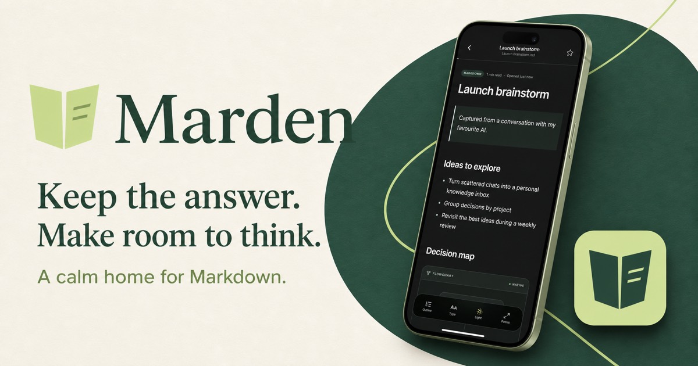

  

  Save useful AI answers, research, plans, notes, and Markdown files—then organise them, read them beautifully, and keep them with you across devices.

  
  
  
  

  <a href="#download-marden">Download</a> ·
  <a href="#whats-new-in-201">What’s new</a> ·
  <a href="#see-marden-in-action">Screenshots</a> ·
  <a href="#made-for-things-worth-returning-to">Why Marden</a> ·
  <a href="#everything-in-its-place">Features</a> ·
  <a href="PRIVACY.md">Privacy</a>

## Download Marden

<table>
  <tr>
    <td align="center" width="33%">
      <strong>Android</strong> 
      Phones and tablets  
      <a href="https://github.com/guyoverclocked/marden/releases/download/v2.0.1/Marden-2.0.1.apk"><strong>Download APK</strong></a>
    </td>
    <td align="center" width="33%">
      <strong>Windows</strong> 
      x64 and ARM64  
      <a href="https://github.com/guyoverclocked/marden/releases/download/v2.0.1/Marden-2.0.1-Windows.exe"><strong>Download universal installer</strong></a>
    </td>
    <td align="center" width="33%">
      <strong>macOS</strong> 
      Apple Silicon  
      <a href="https://github.com/guyoverclocked/marden/releases/download/v2.0.1/Marden-2.0.1-macOS-arm64.dmg"><strong>Download DMG</strong></a>
    </td>
  </tr>
</table>

Marden 2.0.1 is distributed directly through [GitHub Releases](https://github.com/guyoverclocked/marden/releases). It is free to use and does not require an account.

  
<strong>First-time installation</strong>

   
  <strong>Android:</strong> open the downloaded APK and allow installation from your browser or file manager if Android asks. If you installed Marden 2.0.0, export a library backup, uninstall that version, and then install 2.0.1. This one-time step is required because the Android signing certificate changed; uninstalling clears local app data.  
  <strong>Windows:</strong> open the universal installer and follow the setup wizard. Windows may show a SmartScreen notice for this independently distributed build; choose <em>More info</em>, then <em>Run anyway</em> if you trust the download.  
  <strong>macOS:</strong> open the DMG and drag Marden to Applications. This build is not notarized, so on first launch right-click Marden, choose <em>Open</em>, and confirm.

## See Marden in action

<table>
  <tr>
    <td align="center" width="33%"> <strong>Write or paste</strong> Capture an answer from any AI app.</td>
    <td align="center" width="33%"> <strong>Read without distraction</strong> A focused reader that remembers your place.</td>
    <td align="center" width="33%"> <strong>Keep the rich parts</strong> Tables, code, tasks, and Mermaid diagrams.</td>
  </tr>
</table>

## Made for things worth returning to

AI conversations produce useful work: explanations, plans, research, decisions, code notes, and ideas that deserve a life beyond chat history. Marden turns those fragments into a personal reading library.

Paste a response from your favourite AI app, import an existing Markdown file, or start writing inside Marden. Place it in a project when it belongs somewhere—or leave it Unfiled until it does. When you return, it feels like a document, not another conversation to search through.

<table>
  <tr>
    <td width="50%"><strong>For useful AI answers</strong> Keep the response you will actually need again, without keeping the entire chat around it.</td>
    <td width="50%"><strong>For research and learning</strong> Build a readable library of notes, guides, references, and explanations.</td>
  </tr>
  <tr>
    <td width="50%"><strong>For plans and decisions</strong> Give product thinking, meeting follow-ups, and decision logs a durable home.</td>
    <td width="50%"><strong>For technical Markdown</strong> Read code, tables, task lists, links, and supported Mermaid diagrams comfortably.</td>
  </tr>
</table>

## Everything in its place

| | |
| --- | --- |
| **Capture without friction** | Import one or many Markdown files, paste from the clipboard, open supported files directly, or write from scratch. |
| **Read beautifully** | Enjoy a calm reader with light and dark themes, adjustable type, focus mode, document outlines, find, and saved reading progress. |
| **Organise naturally** | Use colour-coded projects, favourites, Unfiled documents, recent reading, and full-library search. |
| **Keep Markdown useful** | Render headings, links, quotes, lists, task lists, code blocks, tables, highlights, and supported Mermaid diagrams. |
| **Carry your library with you** | Sign in with Google for automatic, private cross-device sync. Launch, edits, foregrounding, and network recovery all trigger sync—no Sync button routine required. |
| **Stay in control** | Use Marden without an account, export a portable library backup, and restore it without replacing existing documents. |
| **Protect every edit** | Interrupted syncs retry automatically, incomplete transfers never claim success, and simultaneous offline edits are preserved as conflict copies. |

## What’s new in 2.0.1

<table>
  <tr>
    <td width="50%"><strong>Export real Markdown files</strong> Export one document from its reader or action menu. Marden downloads the <code>.md</code> file on desktop and opens the native share sheet on mobile.</td>
    <td width="50%"><strong>Work with several documents at once</strong> Select multiple library items, select all, then move, export, or delete them together. Bulk deletion includes confirmation and a short undo window.</td>
  </tr>
  <tr>
    <td width="50%"><strong>File imports land where they belong</strong> After importing several Markdown files, assign the whole batch to a project immediately or keep it Unfiled.</td>
    <td width="50%"><strong>More resilient offline copies</strong> Marden repairs missing local document files after loading or syncing and keeps affected library entries visible instead of silently dropping them.</td>
  </tr>
</table>

## Private by design

Marden is local-first. Your library lives on your device and the core app works without signing in. If you choose Google sign-in, Marden syncs your library through account-scoped cloud storage protected by Row-Level Security. There are no ads or analytics SDKs.

Imported files are copied into Marden; the originals are not modified. Backups are created only when you ask for one, and Marden does not upload an exported backup itself.

Read the [Privacy Policy](PRIVACY.md) and [Security Notes](SECURITY.md) for more detail.

## Help and feedback

If something is not working as expected, [open an issue](https://github.com/guyoverclocked/marden/issues) with your platform and Marden version. Do not attach private notes or sensitive Markdown to a public report.

Marden is released under the [MIT License](LICENSE).

---

<strong>Keep the answer. Keep the idea. Make room to think.</strong>

