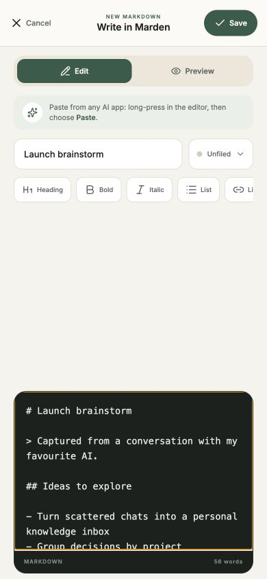
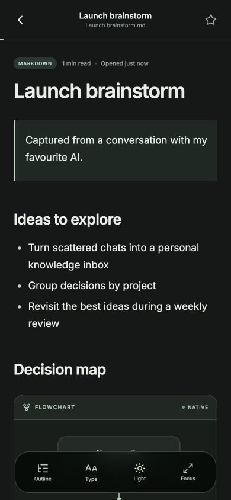
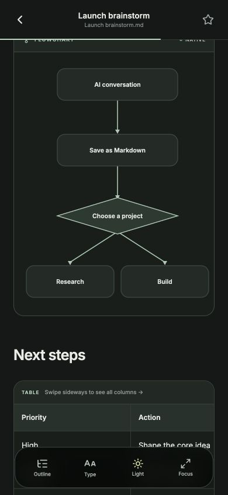

<p align="center">
  
</p>

<h1 align="center">Marden</h1>

<p align="center"><strong>A calm, private home for the ideas worth keeping.</strong></p>

<p align="center">
  Save AI answers, brainstorms, research, plans, and Markdown notes—then organize them into projects and read them beautifully.
</p>

<p align="center">
  <a href="https://github.com/guyoverclocked/marden/releases/latest"></a>
  <a href="https://github.com/guyoverclocked/marden/releases/latest"></a>
  <a href="https://github.com/guyoverclocked/marden/releases/latest"></a>
  <a href="LICENSE"></a>
  
</p>

<p align="center">
  <a href="#why-marden">Why Marden</a> ·
  <a href="#see-marden-in-action">Screenshots</a> ·
  <a href="#what-marden-does">Features</a> ·
  <a href="#install-marden">Install</a> ·
  <a href="#run-it-yourself">Build</a>
</p>

## See Marden in action

<table>
  <tr>
    <td align="center" width="33%"><br /><sub><strong>Write or paste</strong><br />Bring in an answer from any AI app.</sub></td>
    <td align="center" width="33%"><br /><sub><strong>Read without distraction</strong><br />A calm reader with a saved dark theme.</sub></td>
    <td align="center" width="33%"><br /><sub><strong>Keep the rich parts</strong><br />Supported Mermaid flowcharts and swipeable tables.</sub></td>
  </tr>
</table>

## Why Marden

AI conversations produce genuinely useful things: explanations, plans, code notes, research summaries, decisions, and half-formed ideas worth developing. Too often, that work ends up buried in chat history, scattered across apps, or stranded on a clipboard.

**Marden turns those fragments into a personal reading library.** Paste a Markdown response from your favourite AI app, import an existing `.md` file, or write from scratch. Keep it Unfiled for later or place it inside a project. When you return, Marden gives it a focused, comfortable reading experience instead of another text box.

Marden is useful for saving:

- AI answers from ChatGPT, Claude, Gemini, Codex, Perplexity, or any app that can copy text
- Brainstorms, product ideas, prompt experiments, and decision logs
- Research notes, learning material, meeting follow-ups, and how-to guides
- Technical specs, database schemas, code documentation, and supported Mermaid flowcharts
- Any Markdown you want to keep close without building a complicated knowledge system

## What Marden does

| | |
| --- | --- |
| **Capture without friction** | Import `.md` and `.markdown` files, or open the built-in editor to type or paste content from another app. Preview the result before saving. |
| **Organize your way** | Group documents into colour-coded projects, keep loose thoughts in Unfiled, search the library, favourite important files, and jump back into recent reading. |
| **Make Markdown feel native** | Read headings, quotes, lists, links, code, phone-friendly tables, and supported Mermaid flowcharts in a polished mobile layout. |
| **Stay comfortable for longer** | Switch between light and dark themes, adjust type, open a document outline, use focus mode, and resume from saved reading progress. |
| **Keep your writing private** | No account, ads, analytics SDK, or developer-operated content service. Your library is stored in Marden's private app directory on your device. |

## Install Marden

### Android

The fastest route is the installable test APK on the [latest GitHub Release](https://github.com/guyoverclocked/marden/releases/latest).

1. Download `Marden-1.0.3.apk` on your Android phone.
2. Open the downloaded file.
3. If Android asks, allow installs from that browser or file manager.
4. Tap **Install**, then open Marden.

Android may warn about apps installed outside Google Play. That is expected for a sideloaded APK. This first APK is debug-certificate signed for direct testing, not Play Store distribution; uninstall it before switching to a future build signed with a different key. The release assets include a SHA-256 checksum so the download can be verified.

### Apple Silicon Mac

Download `Marden-1.0.3-macOS-arm64.dmg` from the [latest GitHub Release](https://github.com/guyoverclocked/marden/releases/latest), open it, and drag Marden to Applications. The desktop layout uses the same local library and reader experience with wider, bounded content and a two-column document library.

This direct test build is not notarized. On first launch, right-click Marden in Applications, choose **Open**, then confirm. The build runs natively on Apple Silicon Macs; it does not target Intel Macs.

### iPhone

Apple requires every iPhone build to be signed for the device, so this repository cannot provide one universal IPA in the way Android can provide an APK. Marden supports three practical test routes:

- **Expo Go** — quickest test, no paid Apple membership
- **Xcode Personal Team** — a real Marden app icon, signed with a free Apple Account
- **EAS internal build** — a self-contained sideload for registered devices with a paid Apple Developer membership

Follow the step-by-step [iPhone sideload guide](IOS_SIDELOAD.md) for the route that fits you.

## Privacy by design

Marden does not require an account and does not send your Markdown to a Marden server. Documents, project names, favourites, preferences, and reading progress stay on the device. Opening a remote link or displaying a remote image can still contact that destination.

Read the full [privacy policy](PRIVACY.md) and [security notes](SECURITY.md).

## Run it yourself

Marden is built with React Native, Expo SDK 57, and TypeScript.

### Development

Requirements: Node.js 22.13+ and Expo Go on a physical phone.

```bash
git clone https://github.com/guyoverclocked/marden.git
cd marden
npm install
npm start
```

Scan the QR code with Expo Go while the computer and phone are on the same network. If LAN discovery is blocked, use `npx expo start --go --tunnel`.

### Verify the project

```bash
npm run typecheck
npm run doctor
npm run export:web
```

### Build an Android APK

Using EAS Build:

```bash
npx eas-cli@latest login
npm run build:apk
```

For a credential-free local test APK on macOS with Java 17 and Android SDK 36 installed:

```bash
npm run build:apk:local
```

The local script names the result from the app version—for this release, `artifacts/Marden-1.0.3.apk`. Production Android and iOS builds are available through `npm run build:android` and `npm run build:ios`.

### Build the Apple Silicon Mac app

On an Apple Silicon Mac with Node.js 22.13 or newer:

```bash
npm run build:mac
```

This exports the Expo web target and packages it as `artifacts/macos/Marden-1.0.3-macOS-arm64.dmg`.

## Contributing

Thoughtful bug reports, accessibility feedback, and focused pull requests are welcome. Please include the device, operating-system version, and a small sample Markdown file when reporting a rendering issue. Never attach private notes or sensitive AI conversations to a public issue.

Marden is released under the [MIT License](LICENSE).

---

<p align="center"><strong>Keep the answer. Keep the idea. Make room to think.</strong></p>
